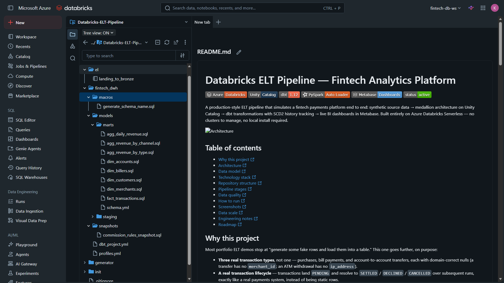
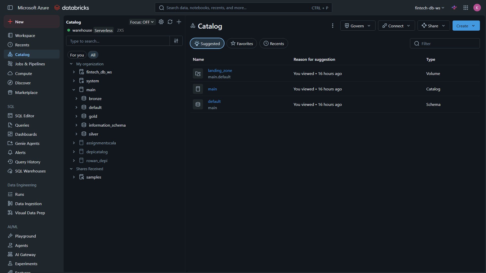
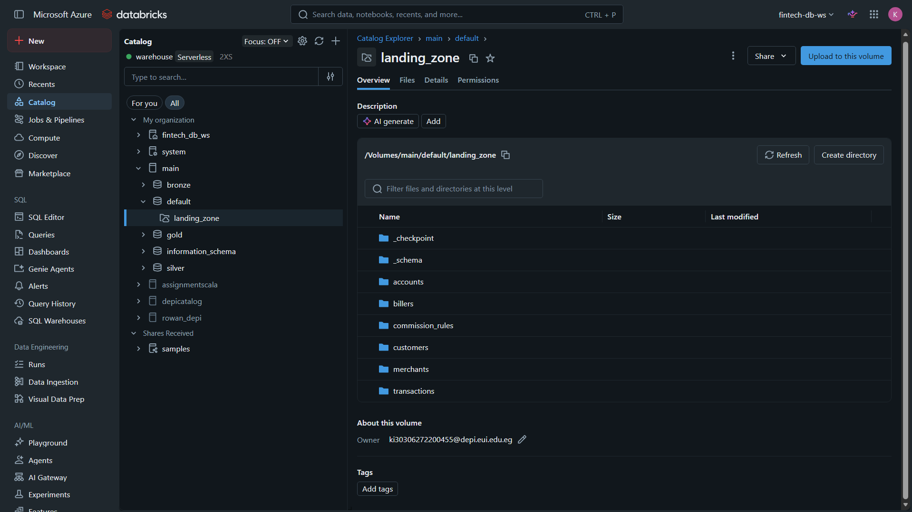
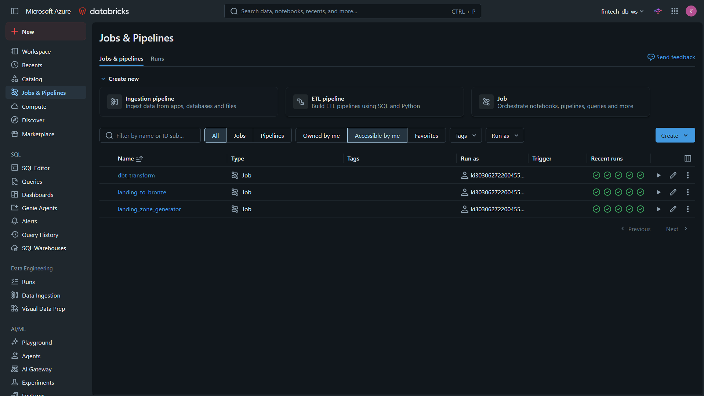
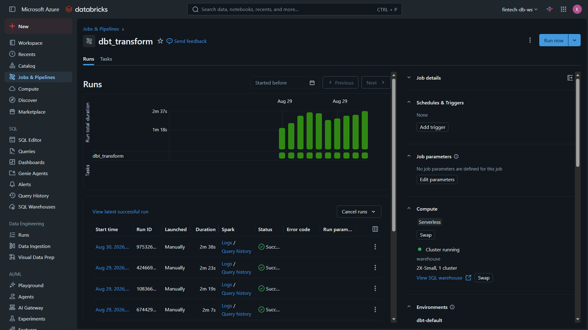
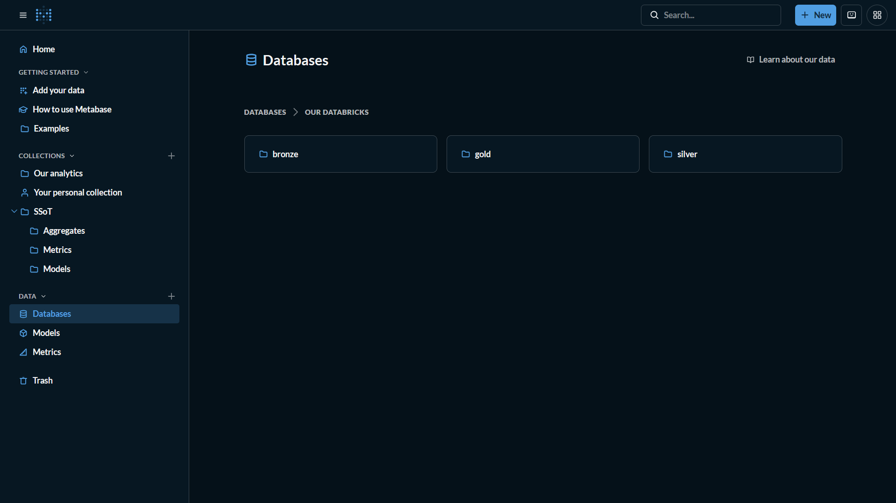
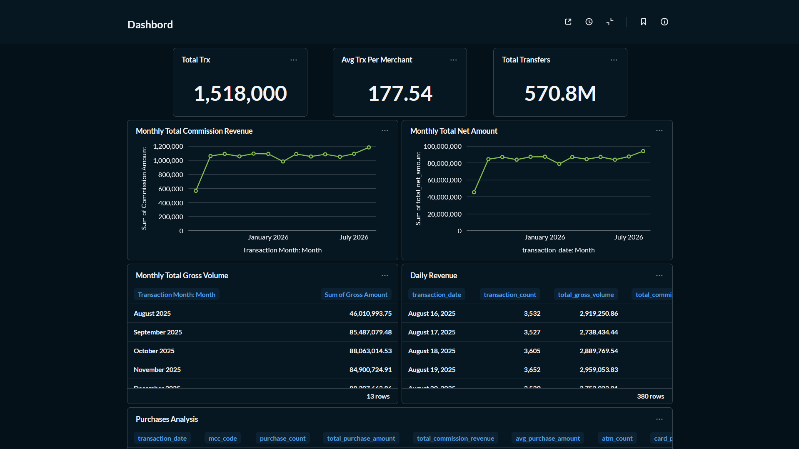
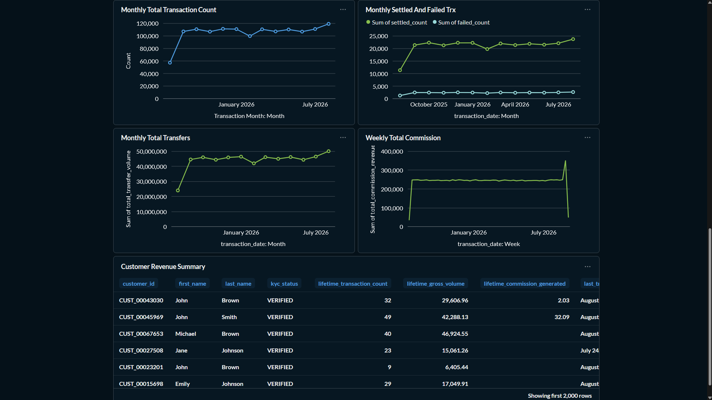

# Databricks ELT Pipeline — Fintech Analytics Platform


A production-style ELT pipeline that simulates a fintech payments platform end to end: synthetic source data → medallion architecture on Unity Catalog → dbt transformations with SCD2 history tracking → live BI dashboards in Metabase. Built entirely on Azure Databricks Serverless — no clusters to manage, no local install required.



## Table of contents

- [Why this project](#why-this-project)
- [Architecture](#architecture)
- [Data model](#data-model)
- [Technology stack](#technology-stack)
- [Repository structure](#repository-structure)
- [Pipeline stages](#pipeline-stages)
- [Data quality](#data-quality)
- [How to run](#how-to-run)
- [Screenshots](#screenshots)
- [Data scale](#data-scale)
- [Engineering notes](#engineering-notes)
- [Roadmap](#roadmap)

## Why this project

Most portfolio ELT demos stop at "generate some fake rows and load them into a table." This one goes further, on purpose:

- **Three real transaction types**, not one — purchases, bill payments, and account-to-account transfers, each with domain-correct nulls (a transfer has no `merchant_id`; an ATM withdrawal has no `ip_address`).
- **A real transaction lifecycle** — transactions land `PENDING` and resolve to `SETTLED` / `DECLINED` / `CANCELLED` over subsequent runs, exactly like a real payments system, instead of being static rows.
- **SCD2 commission history via dbt snapshots** — the source system only ever exposes the *current* fee schedule; dbt reconstructs the full rate history (`dbt_valid_from` / `dbt_valid_to`) automatically, and only ~12% of rules reprice on any given day, not all of them at once.
- **Upsert-correct Bronze ingestion** — Auto Loader streams new files cheaply, but a `MERGE` keyed on the natural business ID keeps Bronze at exactly one current row per entity, instead of accumulating duplicate history for every profile update or status change.
- **A full year of realistic backfilled history**, not everything crammed onto a single day, with statuses that make sense for their age (a transaction from six months ago is never still "pending").

## Architecture

```text
Landing Zone (/Volumes/main/default/landing_zone)
        |
        v
Bronze: raw ingestion tables in main.bronze
        |
        v
Silver: cleaned staging models in main.silver
        |
        v
Gold: dimensions, fact tables, snapshots, and aggregate marts in main.gold
        |
        v
Metabase: models, metrics, dashboards, and public reporting
```

Orchestrated as a single Databricks Workflows job (generator → bronze ingestion → dbt), scheduled to run automatically every 6 hours, entirely on Serverless compute.

## Data model

| Entity | Type | Notes |
|---|---|---|
| `customers` | Dimension | ~100K seeded, grows daily with new signups + profile updates |
| `accounts` | Dimension | ~150K seeded, linked to customers, status flips (Active/Dormant) |
| `merchants` | Dimension | Static reference, MCC-coded |
| `billers` | Dimension | Static reference, category-coded (utilities, telecom, insurance...) |
| `commission_rules` | Mutable source → dbt snapshot | Current fee schedule; dbt reconstructs full history |
| `transactions` | Fact | Polymorphic: `purchase` / `bill_payment` / `transfer`, full lifecycle |

Every transaction carries exactly one populated counterparty column (`merchant_id`, `biller_id`, or `destination_account_id`) depending on its type — never all three, never none.

## Technology stack

- **Azure Databricks** — Serverless compute (notebooks, SQL warehouse, dbt task), Unity Catalog, Volumes
- **PySpark** — synthetic data generation, Auto Loader (`cloudFiles`) streaming ingestion
- **Delta Lake** — `MERGE`-based upserts for Bronze
- **dbt** (`dbt-databricks`) — staging models, snapshots, marts, schema tests — runs as a native Databricks Workspace-sourced task, no local install
- **Metabase** — Models, Metrics, dashboards, public sharing

## Repository structure

```text
Databricks-ELT-Pipeline/
├── README.md
├── init/
│   └── 1.0 init
├── generator/
│   └── landing_zone_generator
├── el/
│   └── landing_to_bronze
└── fintech_dwh/
    ├── dbt_project.yml
    ├── profiles.yml
    ├── macros/
    │   └── generate_schema_name.sql
    ├── snapshots/
    │   └── commission_rules_snapshot.sql
    └── models/
        ├── staging/
        │   ├── sources.yml
        │   ├── schema.yml
        │   ├── stg_customers.sql
        │   ├── stg_accounts.sql
        │   ├── stg_transactions.sql
        │   ├── stg_merchants.sql
        │   └── stg_billers.sql
        └── marts/
            ├── schema.yml
            ├── dim_customers.sql
            ├── dim_accounts.sql
            ├── dim_merchants.sql
            ├── dim_billers.sql
            ├── fact_transactions.sql
            ├── agg_daily_revenue.sql
            ├── agg_revenue_by_channel.sql
            └── agg_revenue_by_type.sql
```

## Pipeline stages

### 1. Initialization
`init/1.0 init` creates `main` catalog, `bronze`/`silver`/`gold` schemas, and the `main.default.landing_zone` Volume.

### 2. Landing zone generation
`generator/landing_zone_generator` writes synthetic data across realistic formats — Parquet (customers, accounts), CSV (merchants, billers), JSON (transactions) — driven by a job widget (`is_incremental: true/false`) so the same notebook handles both the one-time historical backfill and every daily run after.

### 3. Bronze ingestion
`el/landing_to_bronze` ingests via Auto Loader for the tables that receive incremental updates (customers, accounts, transactions), applying a `MERGE` in `foreachBatch` keyed on the business ID so Bronze always reflects current state rather than an ever-growing duplicate log. Static/current-state sources (merchants, billers, commission rules) use a straightforward `CREATE OR REPLACE`.

### 4. Silver — dbt staging
Standardizes casing, trims text, casts types, and derives flags (`has_card`, `is_online`) on top of every Bronze source. Materialized as views.

### 5. Gold — dbt marts
Dimensions, a fully enriched `fact_transactions` (joined to the commission snapshot on valid date range to compute `commission_amount` and `net_amount`), the `commission_rules_snapshot` (SCD2, via `dbt snapshot`), and pre-aggregated daily/channel/type revenue marts.

### 6. Reporting — Metabase
Curated Models sit on top of Gold (never queried raw), organized into collections: base entity models, aggregate rollups (bills, purchases, transfers, overall), and native Metabase Metrics for reusable KPIs. Dashboards are shared via public, no-login links.

## Data quality

dbt schema tests enforce trust in the pipeline at every layer:

- `unique` / `not_null` on every primary business key
- `relationships` tests across facts and dimensions
- `accepted_values` on every bounded domain — `transaction_type`, `status`, `channel`, `account_type`, `account_status`, `kyc_status`, `country_code`

A custom `generate_schema_name` macro ensures models land in the intended `silver`/`gold` schemas instead of dbt's default concatenated naming.

## How to run

```text
1. Run init/1.0 init                          → provisions catalog, schemas, volume
2. Run generator/landing_zone_generator        → is_incremental=false for backfill, true after
3. Run el/landing_to_bronze                    → Auto Loader + merge into main.bronze
4. From fintech_dwh, run: dbt snapshot && dbt run && dbt test
5. Connect Metabase to the Databricks SQL Warehouse, point at main.gold
```

In production, steps 2–4 are chained into a single scheduled Databricks Workflows job — see `docs/screenshots/Orchestration.png`.

## Screenshots

| | |
|---|---|
| **Unity Catalog structure**  | **Landing zone volume**  |
| **Auto Loader ingestion**  | **dbt test suite passing**  |
| **dbt lineage graph**  | **Orchestration**  |
| **Dashboard**  | **Dashoard**  |


## Data scale

| Metric | Volume |
|---|---|
| Customers (seeded) | ~100,000 |
| Accounts (seeded) | ~150,000 |
| Merchants | 5,000 |
| Billers | 300 |
| Transactions (initial backfill) | 1,000,000, spread across 365 days of history |
| New transactions per day | 60,000 |
| dbt schema tests | 28+ across staging and marts |

## Engineering notes

A few real bugs surfaced and fixed during development, kept here because working through them is the actual point of a portfolio project:

- **Referential integrity under ID scheme drift** — once accounts started getting incremental date-based IDs alongside the original sequential ones, generating `account_id` as a padded random number produced orphaned foreign keys. Fixed by sampling real IDs via join instead of regenerating them.
- **Same-day ID collisions** — running a backfill and an incremental pass on the same calendar day produced colliding `transaction_id`s (both keyed off just the date). Fixed with a run-timestamp seed instead of a date-only seed.
- **Flat backfill dates** — the initial "historical" backfill was landing every row on the current date instead of spreading across real history. Fixed by distributing `created_at` across a configurable window, with status realism (only same-day rows can be `PENDING`; older rows are already resolved).
- **dbt schema name concatenation** — dbt's default behavior namespaces custom schemas under the profile's target schema (`silver_silver` instead of `silver`). Fixed with a custom `generate_schema_name` macro.

## Roadmap

- [ ] Extend `fact_transactions` commission matching to scope on `mcc_code`/`biller_category`, not just `transaction_type`
- [ ] Add a `dim_date` calendar table for cleaner BI-side date filtering
- [ ] Row-level fraud/anomaly scoring as a downstream dbt model (kept deliberately out of the raw layer)
- [ ] CI pipeline (GitHub Actions) running `dbt test` on every PR against a dev schema

---

Built as an end-to-end data engineering portfolio project — synthetic data generation, medallion architecture, dbt transformation and testing, and BI delivery, all on Azure Databricks Serverless.
